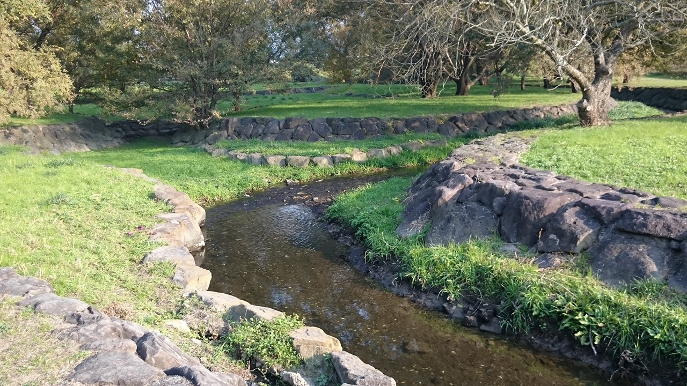
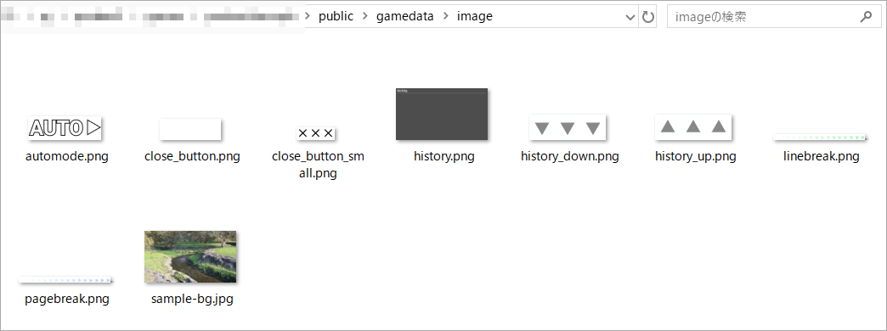
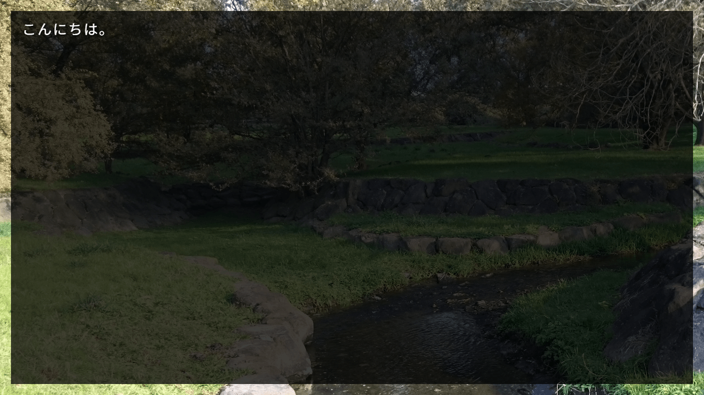

# 画像の表示

文字は表示できたので、次は画像を表示してみましょう。

## 画像を準備する

表示する画像を準備しましょう。

今回は背景として表示することを想定して、1280x720サイズの画像を用意しました。



この画像を保存して、`gamedata/image`に配置してください。



## loadimageコマンド

画像の表示には、[`loadimage`](../ref/command_ref.md#loadimage-image)コマンドを使用します。

<div class="note">
<code>loadimage</code>の省略系として<code>image</code>があります。<br>
吉里吉里2/KAG3を使ったことがある方は、省略形のほうに慣れているかもしれません。
</div>

`loadimage`コマンドで、先ほど配置した`gamedata/image/sample-bg.jpg`を画面に表示してみましょう。
`start.pon`を次のように編集して、実行してみてください。

```plain
# ゲーム開始スクリプト
;call file: "script/init_system.pon"

;loadimage lay: 0, file: "image/sample-bg.jpg", visible: true
こんにちは。
```



背景の画像が表示されました！

`loadimage lay: 0, file: "image/sample-bg.jpg", visible: true`
という記述で、レイヤー0番に`image/sample-bg.jpg`を読み込んで、レイヤーを表示状態にしています。

……意味が分からない単語がいくつか出てきたと思います。
これらはPonkanの画面を構成する「レイヤー」に関する用語です。
レイヤーについては少々複雑なので、次章にて説明します。

### ファイル配置場所とコマンドでの指定方法

先ほどの例では画像ファイルを`gamedata/image`の下に配置して、
コマンドでは`file: "image/sample-bg.jpg"`のように指定しました。

このように、コマンドでファイルを指定する際は`gamedata`以下のパスを書きます。
これは画像だけではなく、音声ファイルでもスクリプトファイルでも同じです。

また、Ponkanは初期状態で`gamedata/image`というディレクトリがあり、
ここにシステムで使う画像なども入っていますが、
実際には`image`以外の場所に画像を置くこともできます。
例えば`gamedata/bgimage`というディレクトリを作って、そこに画像を置いた場合は、次のように指定します。

```
# bgimageに配置したので bgimage/ と指定
;loadimage lay: 0, file: "bgimage/sample-bg.jpg", visible: true
```

このように実際には`gamedata`以下ならどこに配置してもOKです。
ただ、きちんとファイルを整理して配置することをおすすめします。
そのために初期状態である程度ディレクトリを分けています。
