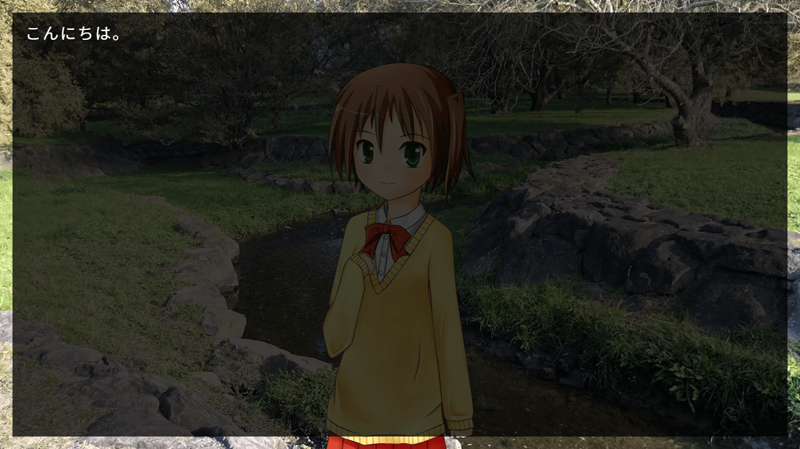
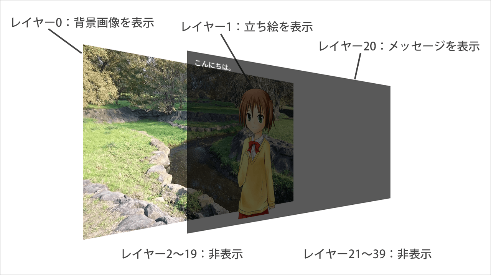

# レイヤーとページ

## レイヤーの基礎

Ponkanの画面表示はすべて、重ね合わせたレイヤーで表示されています。
Photoshopなどの画像編集ソフトのレイヤーと同じようなものです。

以下のスクリプトと画面を例に説明します。

```plain
# ゲーム開始スクリプト
;call file: "script/init_system.pon"

;loadimage lay: 0, file: "image/sample-bg.jpg", visible: true
;loadimage lay: 1, file: "image/chara.png", visible: true, x: 515, y: 100
こんにちは。
```



この画面は、

- 背景の画像
- キャラクターの画像
- メッセージ

の3つで構成されています。これらのレイヤー構成は、次のようになっています。



レイヤーは初期状態で40枚用意されており、0～39の番号で管理されています。
若い番号のレイヤーほど後ろに描画され、大きい番号のレイヤーほど手前に描画されます。

初期状態ではレイヤー20がメッセージレイヤーに設定されているので、ここにメッセージが出力されます。

画像のレイヤーで描画するのかは、コマンドのパラメータの`lay`で設定しています。
また、メッセージレイヤーを除くすべてのレイヤーは最初は非表示状態になっているので、
`image`コマンドの`visible`パラメータでレイヤーを表示状態にしています。

<div class="note">
レイヤーの表示・非表示切替は<code>image</code>コマンドでも可能ですが、通常は<code>layopt</code>コマンドで行います。<br>
<code>layopt</code>コマンドは、レイヤーの座標、サイズ、表示などの設定を行うコマンドです。
</div>

## ページ

Ponkanでは、上記で説明したレイヤー構成が2組あり、それぞれ表ページ・裏ページと呼びます。

表ページは画面に表示されている方のページです。通常、コマンドで操作する対象は表ページになります。

裏ページは画面に表示されません。コマンドで操作するためには、パラメータで`page: "back"`と明示的に指定する必要があります。

前述のとおり、通常のコマンド実行では表ページが操作対象になります。
明示的に指定する場合は、表ページは`page: "fore"`、裏ページは`page: "back"`と指定します。

裏ページは画面に表示されないのになぜ存在するのかというと、これはトランジション（画面切り替え）のためです。
トランジションはページと裏ページを入れ替えることで行うため、その時の一時的な場所として裏ページが利用されます。
トランジションについては別章で説明します。

### カレントページ

カレントページは「現在、メインの操作対象となっているページ」のことです。

レイヤー関係のコマンドで`page: "current"`と指定すると、カレントページが操作対象となります。
カレントページはゲーム起動時は表ページ（`"fore"`）になっており、
`pretrans`コマンドか`currentpage`コマンドによって切り替わります。

<div class="note">
レイヤー関連のコマンドのほとんどが<code>page</code>パラメータを持っていますが、通常は省略して使います。<br>
なぜなら、<code>page</code>を省略すると、デフォルト値である<code>"current"</code>が自動的に設定されるからです。
</div>

## レイヤーの指定方法（`lay`パラメータについて）

レイヤーを操作するコマンドでは、どのレイヤーを対象とするかを`lay`パラメータで指定します。

`lay`の指定の仕方は、番号を一つだけ書くほかに、まとめて指定する方法が用意されています。

| 指定方法            | 記述                   | 対象となるレイヤー      |
|---------------------|------------------------|-------------------------|
| 単一指定            | `lay: 0`               | 0                       |
| 複数指定            | `lay: "0, 1"`          | 0, 1                    |
| 範囲指定            | `lay: "0-5"`           | 0, 1, 2, 3, 4, 5        |
| 単一+複数+範囲      | `lay: "0, 5-7, 10-12"` | 0, 5, 6, 7, 10, 11, 12  |

## 操作対象外レイヤーを指定する（`exclude`パラメータについて）

`lay`パラメータに加えて`exclude`パラメータを指定すると、それらのレイヤーは操作対象外となります。

たとえば、以下のようにレイヤーを指定したとします。

```plain
;layopt lay: "0-9", visible: true
```

`lay`パラメータで`0-9`を指定しているので、操作対象はレイヤー0～9です。

このスクリプトに、追加で`exclude`パラメータを指定したとします。

```plain
;layopt lay: "0-9", exclude: "4,5", visible: true
```

レイヤー4とレイヤー5は操作対象外となるので、操作対象はレイヤー0～3, レイヤー6～9となります。

## 特別なレイヤー

いくつかのレイヤーには特別な役割が割り当てられているものがあります。

それらの特別なレイヤーについては、番号ではなく文字列で指定することができます。

| レイヤー                | 記述                                   |
|-------------------------|----------------------------------------|
| メッセージレイヤー      | `lay: "message"` または `lay: "mes"`   |
| 行末グリフレイヤー      | `lay: "linebreak"`                     |
| ページ末グリフレイヤー  | `lay: "pagebreak"`                     |
| オート状態表示レイヤー  | `lay: "automode"` または `lay: "auto"` |

### メッセージレイヤー

メッセージレイヤーは、メッセージの表示先に指定されたレイヤーです。
初期状態でレイヤー20に設定されています。
メッセージレイヤーを指定する際、レイヤー番号のかわりに`"message"`または`"mes"`と指定することができます。

スクリプト中に書かれたテキストは、メッセージレイヤーに出力されます。

メッセージレイヤーを変更したい場合は、[`messagelayer`](../ref/command_ref.md#messagelayer-messagelay-meslay-meslay)コマンドを利用します。

### 行末グリフレイヤー、ページ末グリフレイヤー

行末クリック待ち、ページ末クリック待ちの際に表示されるレイヤーです。
初期状態ではレイヤー21、22が設定されています。
これらのレイヤーを指定する際、レイヤー番号のかわりに`"linebreak"` `"pagebreak"`と指定することができます。

グリフ用レイヤーは、`linebreak`コマンドや`pagebreak`コマンド実行時に自動的に表示され、クリックされると非表示になります。

### オート状態表示レイヤー

オートモード（自動読み進めモード）のときに表示されるレイヤーです。
初期状態ではレイヤー23が設定されています。
オート状態表示レイヤーを指定する際、レイヤー番号のかわりに`"automode"`または`"auto"`と指定することができます。

オート状態表示レイヤーは、オートモード中は常に表示され、オートが解除されると非表示になります。

## レイヤーエイリアス機能

レイヤーエイリアス機能は、レイヤー指定の番号に名前を付けて、管理を簡単にする機能です。

たとえば、レイヤー0には背景画像、レイヤー1にはキャラクター1の画像を表示する場合、
通常であれば以下のようなスクリプトになります。

```plain
# ゲーム開始スクリプト
;call file: "script/init_system.pon"

;loadimage lay: 0, file: "image/sample-bg.jpg", visible: true
;loadimage lay: 1, file: "image/chara.png", visible: true, x: 515, y: 100
こんにちは。
```

`lay: 0`や`lay: 1`と書いていますが、このくらいのスクリプト量なら問題なくても、
スクリプトが増えてくるとどのレイヤーに何を表示していたかがわからなくなってきます。

そこで、レイヤー番号に名前を付けて、記述をわかりやすくします。

```plain
# ゲーム開始スクリプト
;call file: "script/init_system.pon"

;layalias name: "base", lay: 0
;layalias name: "chara1", lay: 1

;loadimage lay: "base", file: "image/sample-bg.jpg", visible: true
;loadimage lay: "chara1", file: "image/chara.png", visible: true, x: 515, y: 100
こんにちは。
```

このようにわかりやすい名前を付けることで、スクリプトの見通しが良くなります。

ただし、Ponkanで最初から使用されている名前（`"message"`、`"mes"`、`"linebreak"`、`"pagebreak"`、`"automode"`、`"auto"`）は
使用できないので注意してください。

## 吉里吉里2/KAG3との差異

Ponkanのレイヤーと吉里吉里2/KAG3のレイヤでは色々な違いがありますが、
大きな違いは以下の2点です。

- Ponkanでは、すべてのレイヤーで画像表示とメッセージ表示の両方が実行できます。
    - KAG3では背景レイヤ、前景レイヤ、メッセージレイヤと3種類のレイヤがありましたが、Ponkanでは区別はありません。
- Ponkanでは、レイヤーの表示順序は固定です。
    - KAG3では`index`属性でレイヤの重ね合わせ順序を変更できましたが、Ponkanでは変更できません。
