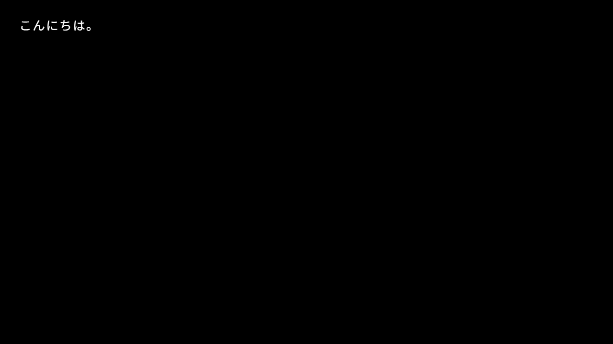

# メッセージ（文章）の表示

## スクリプトでメッセージを出す

まずは何でもいいので、とにかくテキストを表示してみましょう。

Ponkan3では、スクリプトファイルに書いた文字列（テキスト）がそのままメッセージとして画面に表示されるようになっています。

`gamedata`ディレクトリの下に`start.pon`というファイルがあります。
これが、ゲームが開始したときに一番最初に実行されるスクリプトファイルになります。
Ponkan3のゲームはすべて`start.pon`から始まります。

`start.pon`をテキストエディタで開いてみましょう。
テンプレートからゲームを作成した直後は、以下のような内容になっています。

```plain
# ゲーム開始スクリプト
;call file: "script/init_system.pon"

こんにちは。
```

この状態で、ゲームを実行してみてください。
ゲームの実行（表示）は、Windowsなら`start.bat`をダブルクリック、Mac/Linuxなら`start.sh`をターミナルから実行です。



画面に「こんにちは」と表示されました。

先ほどの`start.pon`スクリプトにも「こんにちは。」と記載されている部分がありましたね。
その他にも色々な記載がありますが、まずは「こんにちは。」の部分だけに注目してください。

では試しに、この部分を「はじめてのPonkan3」に変更してみましょう。

```plain
# ゲーム開始スクリプト
;call file: "script/init_system.pon"

はじめてのPonkan3
```

このように編集してから、ブラウザのページを再読み込みしてみてください。


今度は「はじめてのPonkan3」と表示されましたね。

このように、Ponkan3のスクリプトでは、特殊な記述（命令）以外のテキストはすべて画面に表示されるようになっています。

## start.ponの解説

先ほどの`start.pon`では、いくつかの特殊な記述（命令）が使われています。

```plain
# ゲーム開始スクリプト                   ←コメント行
;call file: "script/init_system.pon"     ←コマンド行

こんにちは。                             ←テキスト
```

### コメント行

行の先頭が`#`から始まっている行は、コメント行です。
コメント行は、スクリプトファイルが実行されるときには無視されて、何も実行されません。

コメント行は、スクリプトファイル中に記載された注釈文です。
スクリプトファイルに書かれている内容について補足や解説を書くことができます。

### コマンド行

行の先頭が`;`から始まっている行は、コマンド行です。
コマンド行は、Ponkan3の様々な機能を実行するための命令文です。

たとえば先ほどのスクリプトでは、`call`コマンドを実行して、別のスクリプトファイルを呼び出して実行しています。

Ponkan3には様々なコマンドが用意されており、コマンドを駆使することで大抵のことは実現できるようになっています。

コマンドの詳細については、[コマンドリファレンス](../ref/command_ref.md)に記載されています。
ただ、数が膨大ですので、まずはこのマニュアルのチュートリアルを一通り体験してから参照するとよいでしょう。

### テキスト

特殊な記述（命令）以外の文字は、すべてテキストとして扱われます。

テキストは、メッセージレイヤーに出力されます。メッセージレイヤーについては別章で説明します。

## 行末でクリックを待つ

次に、行末記号を出しながらプレイヤーのクリックを待つようにしてみましょう。

行末でクリックを待つには、`linebreak`コマンドを使用します。

また、Ponkan3ではスクリプト中に改行があっても、メッセージは改行されません。
メッセージを改行するには、`br`コマンドを使用する必要があります。

では、スクリプトを次のように変更してみましょう！

```plain
# ゲーム開始スクリプト
;call file: "script/init_system.pon"

こんにちは。
;linebreak
;br
改行して、２行目です。
```

変更したら、ページを再読み込みしましょう。


「こんにちは。」と表示された後にクリック待ち状態で停止して、クリックすると二行目が表示されたと思います。

## ページ末でクリックを待つ

今度は行末ではなく、ページ末でクリック待ちをしてみましょう。

ページ末でクリックを待つには、`pagebreak`コマンドを使用します。

ページを切り替えるためには、メッセージをすべてクリアすればよいでしょう。
メッセージのクリアには`clear`コマンドを使用します。

では、スクリプトを次のように変更してみましょう。

```plain
# ゲーム開始スクリプト
;call file: "script/init_system.pon"

こんにちは。
;linebreak
;br
改行して、２行目です。
;pagebreak
;clear
改ページして、２ページ目になりました。
```

これを実行すると、「改行して、２行目です。」の後にクリック待ちになり、
クリックすると改ページされます。


## コマンド名の省略形について

`linebreak`や`pagebreak`のような少し長いコマンドには、省略された名前が用意されています。

たとえば`linebreak`には、省略形として`lb`と`l`の2つが用意されています。
これらはどれも同じ動作になるので、好きなものを使用してください。
それぞれメリット・デメリットがあるので、場面によって使い分けるのもおすすめです。

- 長い名前
    - メリット：省略されてないのでコマンドの意味が分かりやすい
    - デメリット：入力するのが大変
- 短い名前
    - メリット：入力が楽
    - デメリット：コマンドの意味が分かりづらい
