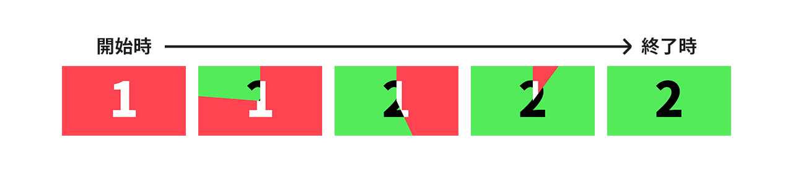
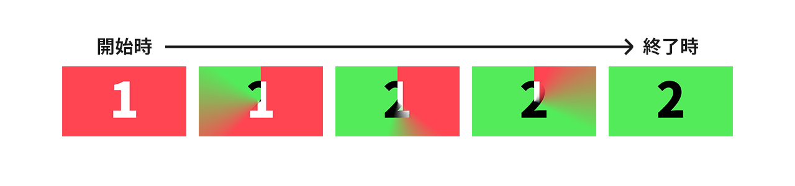
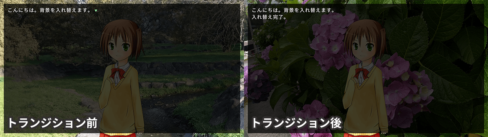

# トランジション

フェードインなどの効果を適用しながら場面を移ることをトランジションと呼びます。

Ponkanでは、クロスフェードトランジション、ユニバーサルトランジションがサポートされています。

トランジションは[`trans`](../ref/command_ref.md#trans)コマンドで実行できますが、トランジションする前に、いろいろと準備が必要です。

## クロスフェードトランジション

クロスフェードトランジションは最も単純なトランジションです。
裏ページの画面がフェードインしてくるような動きになります。

## ユニバーサルトランジション

ユニバーサルトランジションは、ルール画像と呼ばれる画像に従って移り変わるトランジションです。

ルール画像とは、以下のようなグレースケールの画像を指します。


ユニバーサルトランジションでは、ルール画像の黒い部分から裏レイヤが表示されていきます。
また、`vague`パラメータの値によって、境界のあいまい領域を設定することができます。

表ページ、裏ページ、ルール画像が以下のような場合を例にあげます。


「1」と書かれた表ページから「2」と書かれた裏ページにトランジションさせます。
この時、`vague: 0`で実行したときは以下のようにトランジションします。



このように、ルール画像の黒いところから順に変化しているのがわかります。

今度は同じ条件で、`vague: 0.25`として実行してみます。すると、次のようになります。



境界の部分があいまいになったのがわかると思います。`vague`を設定すると、表ページと裏ページが混在している領域を作ることができます。
`vague`には`0.0～1.0`の値を設定することができます。

## トランジションとページ

「[レイヤーとページ](./layer.md)」でも説明しましたが、Ponkanのレイヤーには表ページと裏ページがあり、
ゲーム開始時はどちらも全く同じ状態になっています。

トランジションは、表ページをだんだんと非表示にしつつ、裏ページをだんだんと表示していく、という動きになります。

トランジションが終わると、表ページと裏ページが入れ替わります。それまで裏ページだったものは表ページになり、表ページだったものは裏ページになります。

## 背景をクロスフェードで切り替える

ここでは例として、背景画像をクロスフェードで切り替えてみます。

以下のスクリプトにそって説明します。

```plain
# ゲーム開始スクリプト
;call file: "script/init_system.pon"

# 背景とキャラクターを表示
;image lay: 0, file: "image/bg01.jpg", visible: true
;image lay: 1, file: "image/chara01.png", visible: true, x: 515, y: 100
こんにちは。背景を入れ替えます。
;linebreak
;br

# 背景をbg02に変更する
;pretrans
;image lay: 0, file: "image/bg02.jpg"
;trans time: 2000, method: "crossfade"
;waittrans
入れ替え完了。
```



### 入れ替え前の背景とキャラクターを表示

まず、入れ替え前の背景とキャラクターを表ページに読み込みます。

```plain
# 背景とキャラクターを表示
;image lay: 0, file: "image/bg01.jpg", visible: true
;image lay: 1, file: "image/chara01.png", visible: true, x: 515, y: 100
```

これで表ページのレイヤー0に背景画像、レイヤー1にキャラクターが表示されました。

その次の部分は、メッセージを表示してクリックを待っているだけです。

```plain
こんにちは。背景を入れ替えます。
;linebreak
;br
```

### 表ページの状態を裏ページにコピーする

次に、トランジションの前準備として表ページの状態を裏ページにコピーします。

トランジションで入れ替えたいのは背景画像だけなので、その他のレイヤーは表ページと全く同じ状態にしておく必要があります。
いちいち手動で同じ状態にそろえるのは大変なので、表ページの状態をコピーするコマンドが用意されています。

`pretrans`コマンドを使い、表ページの状態を裏ページにコピーします。

```plain
;pretrans
```

そして、変更後の背景画像を裏ページに読み込みます。

```plain
;image lay: 0, file: "image/bg02.jpg"
```

「あれ？　裏ページに読み込むのに、`page: "back"`が無いぞ」と気づいた方は鋭いです。
実は`pretrans`コマンドのもう一つの処理として、「次に`trans`が実行されるまで、カレントページを裏ページに切り替える」というものがあります。
これにより、裏ページを明示的に指定しなくても、`pretrans`～`trans`の間は裏ページを操作できます。

<div class="note">
前述のとおり、<code>pretrans</code>の処理は「1.表ページを裏ページにコピー」「2.操作対象を裏ページにする」の2つの処理になります。<br>
もしこれらの処理を別々に実行したい場合は、<code>backlay</code>コマンドと<code>currentpage</code>コマンドを利用してください。
<code>backlay</code>が表ページを裏ページにコピーするコマンド、<code>currentpage</code>が操作対象ページを変更するコマンドです。
</div>

### トランジション実行して、終了するまで待つ

準備が整ったので、トランジションを実行します。

```plain
;trans time: 2000, method: "crossfade"
;waittrans
入れ替え完了。
```

`waittrans`コマンドは、トランジションの完了を待つコマンドです。
Ponkanの`trans`コマンドは、トランジションが完了するのを待ちません。`waittrans`コマンドがない場合は、トランジションをしながら処理が継続してしまいますので、注意してください。
（逆に、そのような処理をやりたいことがあるかもしれません。）

`trans`が実行されると、カレントページが表ページに戻されます。
したがって、「入れ替え完了。」のテキストは表ページに出力されるので、ちゃんと画面に表示されます。

これでトランジションが実行できました。
今回の例は背景画像だけを入れ替える簡単なものでしたが、どんなトランジションでも基本的な流れは同じです。

1. `pretrans`で準備する
2. 裏レイヤーの状態を操作して、トランジション後の状態を作る
3. `trans`でトランジション実行
4. `waittrans`で完了を待つ

## 吉里吉里2/KAG3との差異

- Ponkanでは、ルール画像が小さいときは画面と同じサイズに拡大されて使用されます。
    - KAG3では、画面を覆えるまでタイル状に敷き詰められて使用されます。
- スクロールトランジションは現在未実装です。
- 拡張トランジションは未実装です。
- Ponkanでは、全レイヤー一括のトランジションのみ対応しています。
    - KAG3では`[trans layer="1" time="1000"]`のようにして個別にトランジションできますが、このようなことはできません。
